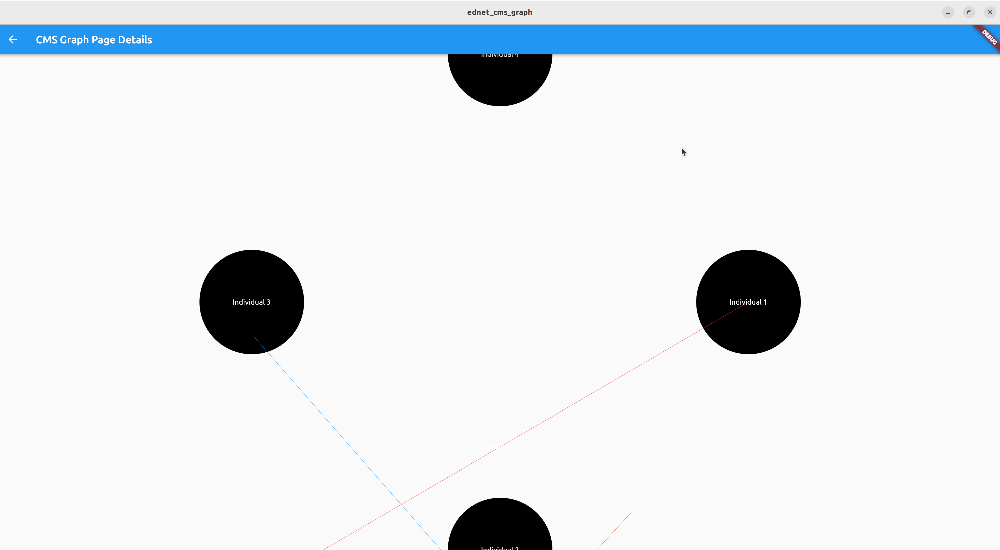

# Current state


# Content managed system Graph render
For any given Content managed system, this package will render the graph of the content and its relations within system ond endless movable Canvas.

- [Nodes] are instances of type [SemanticContentRole] for particular [Content].
- Semantic Content Role is a role that a content assumes in a particular context.
    >For example, a content can be a [Subject] in a [Course] or a [Course] in a [CourseGroup].

We can represent a graph as a list of nodes and a list of edges. 

Nexus Node is a node that is not connected to any other node. It is a node that is not a part of any graph.

Visually nodes are arranged in a circle, and edges are drawn between nodes.

So even continuous functions could be represented as graphs for some value of x belonging to the subdomain of the function.

Codomain of the function is the set discrete values of the function.

e.g. f(x) = x^2

x = 1, 2, 3, 4, 5, 6, 7, 8, 9, 10
y = 1, 4, 9, 16, 25, 36, 49, 64, 81, 100

```dart
import 'package:graph_render/graph_render.dart';

const domain = [1, 2, 3, 4, 5, 6, 7, 8, 9, 10];
const codomain = [1, 4, 9, 16, 25, 36, 49, 64, 81, 100];

final graph = Graph(
  nodes: domain.map((x) => Node(x.toString(), x.toString())).toList(),
  edges: codomain
      .map((y) => Edge(
            source: domain[codomain.indexOf(y)].toString(),
            target: y.toString(),
            label: y.toString(),
          ))
      .toList(),
);

final graphRender = GraphRender(graph);

final graphRenderWidget = graphRender.render();
```

Edges of this graph represents semantic relations between nodes and their interaction artefacts, so for example in domain model of direct democracy is Vote related to Proposal and Proposal related to User. Their semantic relations are various:

     ```
      User --Proposes--> Proposal
      User --Votes--> Vote
      User --Comments--> Comment
      User --Likes--> Like
      User --Shares--> Share
    
      Proposal --Made by--> User
      Vote --Cast by--> User
      Comment --Made by--> User
      Like --Made by--> User
      Share --Made by--> User
    
      Vote --On--> Proposal
      Comment --On--> Proposal
      Like --On--> Proposal
      Share --On--> Proposal
    ```
So we see that SemanticNode knows about its semantic relations and their semantic roles, and directionality of the semantic relations as it have different forms looking from different angle.

## Flutter render on endless Canvas

[Canvas] is a widget that can be used to draw arbitrary shapes using the [Canvas] API.

[CMSCanvas] is a widget utilizing Flutter [Canvas] to render a graph on an endless draggable background. 
It takes nodes and based on defaults renders a visually optimized, accessible and appealingly pleasant graph:
- Starts nodes position calculation from [DefaultFocusPoint] as a center of the graph and from there calculates the optimal position of the nodes and edges again default values, taking in account that all [Nodes] and [Edges] are rendered until [DefaultDepth] is reached. 
- This is inverse recursive algorithm which takes care about nodes immediate relations and their relations and so on until [DefaultDepth] is reached so that it is possible to render minimal [GraphTheme] themed graph with single [NodeTypeStyle]s (like [EdgeLineStyle], [EdgeTextStyle], [FocusLineStyle], [FocusTextStyle])  that is still useful for the user, centered on screen and with all nodes and edges rendered. 
- Once [DefaultDepth] is reached, the algorithm renders further nodes and edges only if they are connected to the nodes that are already rendered plus some visual pre rendered and pre-calculated padding of [DefaultVisualPadding]=500px in all directions. 
    >This is done to prevent graph from being too cluttered and to prevent nodes from being rendered too far away from the center of the graph and to enable smooth and pleasant user experience of the graph navigation with either TAB on Keyboard and navigation arrows, or simple dragging.
- Important to notice is that [DefaultDepth] is not a limit of the graph, but rather a limit of the graph that is rendered on the screen:
  - [DefaultDepth] is a limit of the graph that is rendered on the screen with accent in UI/UX sense, so that the graph is not too cluttered and is still useful for the user.
  - it assumes role of[LevelOfIndirection] for [FocusNode]s rendered from outer edges relative to,[DefaultFocusPoint] and It's [DefaultDepth] and [DefaultVisualPadding] and [DefaultSemanticEdge] and [DefaultNodeTypeStyle]s. [LevelOfIndirection] is used so that the graph further away of active focus node  is rendered with less visual emphasis and less visual clutter, zoomed out at rendering calculation level to occupy in logarithmic function less and less space from current active node and its dept level.
  - Mouse or keyboard zooming action represents for rendering algorithm a change of [LevelOfIndirection] and it's [DefaultDepth] and [DefaultVisualPadding] and [DefaultSemanticEdge] and [DefaultNodeTypeStyle]s and just sets new [ActiveFocusPoint] in accordance with mouse or keyboard focus position and use that node as a starting point for zoom of 1 and renders rest from there again with zooming out as we are further away.
  - Dragging and zooming actions are animated, continuous and smooth, so that the user can navigate the graph with ease and pleasure.

[FocusPoint] is a widget that can be used to focus on a particular point on the graph.

[DefaultFocusPoint] is a [CMS] [Node] that is used as default [FocusPoint] for the graph.

[DefaultDepth] is default number (2) of rendered relations that is used as default [Depth] for the graph.

[DefaultSemanticEdge] is a default [SemanticEdgeClass] of [SemanticEdge]s that is used as default [AccentedSemanticEdge] for the graph.

[DegreeOfUsefulness] is a widget that can be used to set the number of rendered relations of single [FocusPoint].
Sometimes are some nodes important as [NexusPoint], so that we want to render them and their 100's of relations even if they are not connected to the [FocusPoint] and [Depth] is reached.

Each [NodeWidget] is a [StatelessWidget] modeling tuple of the form `(id, label)`, where `id` is a unique identifier for the node and `label`=[node.name], is a string that will be displayed on the node.

Each [EdgeWidget] is a [StatelessWidget] modeling tuple `(source, target, label)`, where `source` and `target` are the `id`s of the nodes that the edge connects, and `label` is a string that will be displayed on the edge.

Each [EdgeWidget] models [SemanticNode] so that it places text above and below line of the edge with the name of the relation between the nodes, above from left to right and below from right to left. Name of relation always involves action language with connected nodes as actors in some mini scenario. Involving also outputs of interaction as further [SemanticNode]s but with other visual theme.