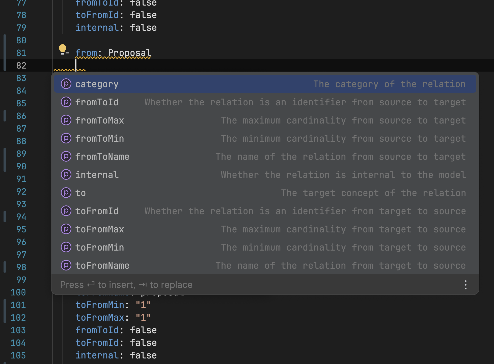

# EDNetCoreDSL Schema Documentation

## Overview

The EDNetCoreDSL (Domain-Specific Language) is designed to simplify the process of defining domain models for EDNetCore applications. This schema provides a structured way to describe domains, models, concepts, attributes, and relationships, enabling rapid development and maintenance of complex domain models.

## Schema Structure

The EDNetCoreDSL schema is defined in JSON and supports the following top-level elements:

- `domain`: The name of the domain (string)
- `model`: The name of the model within the domain (string)
- `concepts`: An array of concept definitions
- `relations`: An array of relationship definitions between concepts

### Concepts

Each concept in the `concepts` array represents an entity in your domain model and has the following structure:

```json
{
  "name": "string",
  "entry": boolean,
  "attributes": [
    {
      "name": "string",
      "category": "enum",
      "sequence": "integer",
      "init": "string",
      "essential": boolean,
      "sensitive": boolean,
      "type": "string"
    }
  ]
}
```

- `name`: The name of the concept (required)
- `entry`: Indicates if this is an entry point for the model (optional)
- `attributes`: An array of attribute definitions for the concept

#### Attributes

- `name`: The name of the attribute (required)
- `category`: The category of the attribute (enum: "guid", "identifier", "required", "")
- `sequence`: The order of the attribute (integer)
- `init`: The initial value of the attribute (string)
- `essential`: Indicates if the attribute is essential (boolean)
- `sensitive`: Indicates if the attribute contains sensitive data (boolean)
- `type`: The data type of the attribute (string)

### Relations

The `relations` array defines relationships between concepts:

```json
{
  "from": "string",
  "to": "string",
  "fromToName": "string",
  "fromToMin": "string",
  "fromToMax": "string",
  "fromToId": boolean,
  "toFromName": "string",
  "toFromMin": "string",
  "toFromMax": "string",
  "toFromId": boolean,
  "internal": boolean,
  "category": "enum"
}
```

- `from`: The source concept of the relation (required)
- `to`: The target concept of the relation (required)
- `fromToName`: The name of the relation from source to target (required)
- `fromToMin`: The minimum cardinality from source to target (required)
- `fromToMax`: The maximum cardinality from source to target (required)
- `fromToId`: Indicates if the relation is an identifier from source to target
- `toFromName`: The name of the relation from target to source (required)
- `toFromMin`: The minimum cardinality from target to source (required)
- `toFromMax`: The maximum cardinality from target to source (required)
- `toFromId`: Indicates if the relation is an identifier from target to source
- `internal`: Indicates if the relation is internal to the model
- `category`: The category of the relation (enum: "inheritance", "reflexive", "twin", "rel")

## IDE Integration and Benefits

The EDNetCoreDSL schema is designed to work seamlessly with modern IDEs, providing several advantages:

1. **Validation**: IDEs can validate your `.ednet.yaml` files against the schema, catching errors and inconsistencies early in the development process.

2. **Auto-completion**: As you type, the IDE can suggest valid options for properties and values, speeding up the modeling process and reducing errors.

3. **Contextual Documentation**: Hovering over properties in your `.ednet.yaml` file provides instant access to descriptions and usage information, as shown in the image below:

   

4. **Quick Navigation**: IDEs can provide quick navigation features, allowing you to jump between related concepts and attributes easily.

## Usage

To take advantage of IDE integration:

1. Configure your IDE to use the EDNetCoreDSL schema for `*.ednet.yaml` files.
2. Create your domain model files with the `.ednet.yaml` extension.
3. Use the schema-aware features of your IDE to efficiently create and edit your domain models.

## Example

Here's a simple example of a domain model using the EDNetCoreDSL:

```yaml
domain: Bookstore
model: Inventory
concepts:
  - name: Book
    entry: true
    attributes:
      - name: title
        category: required
        type: String
      - name: isbn
        category: identifier
        type: String
      - name: price
        type: Decimal
  - name: Author
    attributes:
      - name: name
        category: required
        type: String
relations:
  - from: Book
    to: Author
    fromToName: writtenBy
    fromToMin: "1"
    fromToMax: "N"
    toFromName: wrote
    toFromMin: "0"
    toFromMax: "N"
    category: rel
```

This example defines a simple bookstore inventory model with `Book` and `Author` concepts and a relationship between them.

By leveraging the EDNetCoreDSL schema and IDE integration, you can efficiently create, validate, and maintain complex domain models for your EDNetCore applications.
